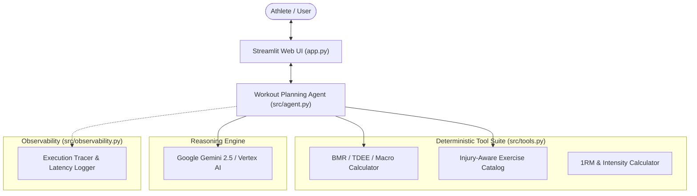

# 🏋️‍♂️ FitForge AI - Workout Planning Agent

An autonomous AI fitness coach and workout planning agent built for the **Google AI in 5 Days Assessment**.

FitForge AI combines deterministic exercise science algorithms with LLM reasoning (Gemini / Vertex AI) to design safe, personalized, progressive workout routines with complete nutrition baselines and interactive coaching chat.

---

## 🌟 Problem & Solution

- **The Problem:** Generic fitness plans fail to account for individual constraints (joint injuries, limited equipment, exact metabolic rates, or progressive overload rules), leading to stalled progress, plateaus, or injury.
- **The Solution:** An autonomous Workout Planning Agent that gathers athlete biometrics, calculates exact energy expenditures and macronutrient needs, queries an injury-aware exercise catalog, and generates periodized weekly routines with real-time coaching support.

---

## 🏗️ Architecture



---

## 📊 Evaluation Rubric Mapping

This project is built to satisfy all 5 assessment criteria:

| Category | Implementation in FitForge AI |
| :--- | :--- |
| **1. Tool & Interface Design** | Deterministic calculation tools (Mifflin-St Jeor BMR/TDEE, macro partitioning, 1RM zones) + Curated exercise catalog with injury contraindication filtering. Interactive Streamlit UI with markdown and JSON export. |
| **2. Context & Memory** | Multi-turn conversational memory (`chat_history`) supporting iterative adjustments, exercise swaps, and volume tuning. |
| **3. Orchestration & Logic** | Agent coordinates deterministic tools with Gemini reasoning, applying progressive overload principles and safety constraints. |
| **4. Observability & Tracing** | `ExecutionTracer` tracks step-by-step tool invocations, duration latencies (ms), and structured logging. |
| **5. Infrastructure & CI/CD** | Clean modular layout, `requirements.txt`, `.env.example`, automated `pytest` test suite, and GitHub Actions CI workflow (`.github/workflows/ci.yml`). |

---

## 🚀 Quickstart Guide

### 1. Clone & Setup Environment

```bash
# Clone the repository
git clone <your-repo-url>
cd <repo-folder>

# Create and activate virtual environment
python3 -m venv .venv
source .venv/bin/activate

# Install dependencies
pip install -r requirements.txt
```

### 2. Configure Authentication (Optional)

Create a `.env` file from the template:
```bash
cp .env.example .env
```

You can use either:
- **Google AI Studio API Key:** Set `GEMINI_API_KEY=your_key` in `.env` (or enter it in the Streamlit UI sidebar). Get a key at [Google AI Studio](https://aistudio.google.com/app/api-keys).
- **Vertex AI:** Set `GOOGLE_CLOUD_PROJECT=your_project_id` and run `gcloud auth application-default login`.
- **Demo / Mock Mode:** Select "Demo / Mock Mode" in the UI to run offline without an API key.

### 3. Launch the Streamlit Web UI

```bash
streamlit run app.py
```

Open your browser at `http://localhost:8501`.

---

## 🧪 Running Tests

Run the automated test suite with pytest:

```bash
pytest tests/ -v
```

---

## 📁 Repository Structure

```
├── app.py                      # Streamlit Web Application entrypoint
├── src/
│   ├── __init__.py
│   ├── models.py               # Pydantic schemas (UserProfile, WorkoutPlan, etc.)
│   ├── tools.py                # Deterministic calculation & exercise lookup tools
│   ├── agent.py                # WorkoutAgent (Gemini / Vertex AI integration)
│   └── observability.py        # Latency tracing and structured logging
├── tests/
│   ├── __init__.py
│   ├── test_tools.py           # Unit tests for calculation & exercise tools
│   └── test_agent.py           # Tests for agent initialization & plan generation
├── .github/
│   └── workflows/
│       └── ci.yml              # GitHub Actions CI pipeline
├── .env.example                # Environment variables template
├── requirements.txt            # Project dependencies
└── README.md                   # Project documentation
```
