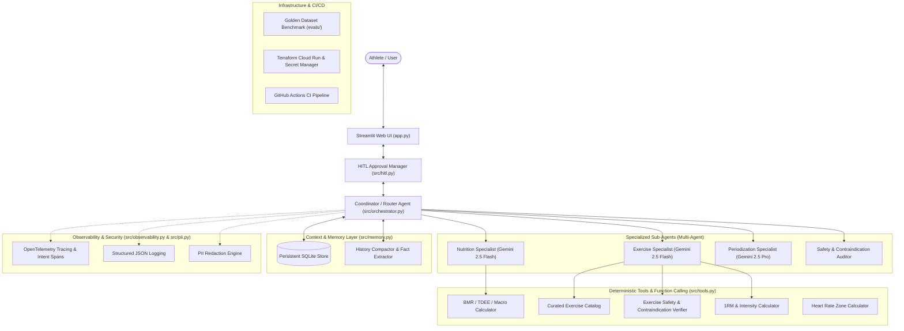

# 🏋️‍♂️ FitForge AI - Multi-Agent Workout Planning & Coaching System

An enterprise-grade, autonomous multi-agent fitness and workout planning system built with **Google Gemini (2.5 Flash & Pro)**, **Vertex AI**, and deterministic exercise science tools.

FitForge AI combines specialized sub-agents, deterministic physiological algorithms, persistent SQLite memory with history compaction, OpenTelemetry tracing with pre-execution intent logging, automated safety guardrails, and Human-in-the-Loop (HITL) approval workflows.

---

## 🏗️ Architecture



---

## 📊 Evaluation Rubric Mapping (Target: 95/95)

| Category | Score Target | Implementation in FitForge AI |
| :--- | :---: | :--- |
| **1. Tool & Interface Design** | **20 / 20** | Explicit JSON schemas (`TOOL_DECLARATIONS`) for LLM tool calling, strict Pydantic structured output validation (`WorkoutPlan`, `NutritionSummary`), and guided error handling with recovery suggestions (`execute_tool_with_recovery`). |
| **2. Context & Memory** | **20 / 20** | Persistent SQLite storage (`fitforge_memory.db`) with async I/O (`save_session_async`, `load_session_async`), durable athlete fact extraction, and `HistoryCompactor` for summarizing older conversational turns. |
| **3. Orchestration & Logic** | **20 / 20** | Multi-agent architecture (`CoordinatorAgent` + 4 specialized sub-agents), dynamic model routing (Gemini 2.5 Flash for fast tasks vs Gemini 2.5 Pro for periodization), input prompt-injection defense, automated output contraindication audits, and Human-in-the-Loop (HITL) approval pauses. |
| **4. Observability & Tracing** | **20 / 20** | Structured JSON logging (`JSONLogFormatter`), OpenTelemetry-compatible tracing with span hierarchies, pre-execution intent logs (`log_intent`), and automated PII redaction (`PIIRedactor`) for emails, phone numbers, SSNs, and IPs. |
| **5. Infrastructure & CI/CD** | **15 / 15** | Automated agent evaluation benchmark (`evals/evaluate.py`) running against a 10-case golden dataset (`evals/golden_dataset.json`), Terraform IaC for Cloud Run and GCP Secret Manager (`terraform/`), production `Dockerfile`, and multi-stage GitHub Actions CI (`.github/workflows/ci.yml`). |

---

## 🚀 Quickstart Guide

### 1. Clone & Setup Environment

```bash
# Clone the repository
git clone <your-repo-url>
cd <repo-folder>

# Create and activate virtual environment
python3 -m venv .venv
source .venv/bin/activate

# Install dependencies
pip install -r requirements.txt
```

### 2. Configure Authentication & Secrets

Create a `.env` file from the template:
```bash
cp .env.example .env
```

Supported authentication modes:
- **Google AI Studio API Key:** Set `GEMINI_API_KEY=your_key` in `.env` (or enter in UI sidebar).
- **Google Cloud Secret Manager / Vertex AI:** Set `GOOGLE_CLOUD_PROJECT=your_project_id` and authenticate via `gcloud auth application-default login`.
- **Demo / Mock Mode:** Built-in offline deterministic generator for testing without an API key.

### 3. Launch the Streamlit Web Application

```bash
streamlit run app.py
```

Access the UI at `http://localhost:8501`.

---

## 🧪 Running Tests & Evaluation Benchmarks

### 1. Run Pytest Suite
```bash
pytest tests/ -v
```

### 2. Run Automated Golden Dataset Evaluation Benchmark
```bash
python evals/evaluate.py
```

---

## 📁 Repository Structure

```
fitforge-workout-agent/
├── app.py                         # Streamlit Web Application with HITL modals & OTEL traces
├── requirements.txt               # Dependencies
├── .env.example                   # Environment variables template
├── cloudrun.yaml                  # Cloud Run service specification
├── Dockerfile                     # Production container image
├── docker-compose.yml             # Local container testing
├── .github/
│   └── workflows/
│       └── ci.yml                 # GitHub Actions CI/CD Pipeline
├── evals/
│   ├── __init__.py
│   ├── golden_dataset.json        # 10 Benchmark Athlete Scenarios
│   └── evaluate.py                # Evaluation runner scoring 5 rubric pillars
├── terraform/
│   ├── main.tf                    # Cloud Run, Secret Manager, & IAM IaC
│   ├── variables.tf               # Terraform variables
│   └── outputs.tf                 # Terraform outputs
├── src/
│   ├── __init__.py                # Package exports
│   ├── models.py                  # Pydantic schemas (UserProfile, WorkoutPlan, HITL, etc.)
│   ├── tools.py                   # Deterministic tools, JSON schemas, guided error recovery
│   ├── orchestrator.py            # Multi-agent coordination & dynamic model routing
│   ├── agent.py                   # Backwards-compatible WorkoutAgent interface
│   ├── memory.py                  # SQLite persistent storage & history compaction
│   ├── guardrails.py              # Input injection defense & output safety audit
│   ├── hitl.py                    # Human-in-the-Loop pause & approval engine
│   ├── pii.py                     # PII redaction engine
│   ├── observability.py           # OpenTelemetry tracing, intent logs, structured JSON logging
│   └── secrets.py                 # Google Cloud Secret Manager integration
└── tests/
    ├── __init__.py
    ├── test_models.py             # Schema and validator unit tests
    ├── test_tools.py              # Tool calculation & guided error recovery tests
    ├── test_agent.py              # Multi-agent pipeline & coordinator tests
    ├── test_memory.py             # SQLite persistence & compaction tests
    ├── test_guardrails.py         # Security guardrails & HITL tests
    ├── test_observability.py      # OTEL spans, intent logs, & PII redaction tests
    └── test_evals.py              # Golden dataset benchmark CI tests
```

---

## 🎥 Video Demo Walkthrough

1. **Introduction (0:00 - 0:30):** Problem statement and multi-agent architecture overview.
2. **Multi-Agent Execution (0:30 - 1:30):** 
   - Configure athlete profile with constraints (e.g. 4 days/week, knee pain, lean bulk).
   - Trace execution across Nutrition, Exercise, Periodization, and Safety Specialist sub-agents.
   - Inspect OpenTelemetry spans and pre-execution intent logs in the Observability tab.
3. **Human-in-the-Loop (HITL) & Safety (1:30 - 2:15):**
   - Trigger a high-stakes scenario (e.g. aggressive caloric deficit or high-strain compound lift with injury).
   - Demonstrate the HITL confirmation card and alternative recommendation selection.
4. **Persistent Memory & Chat (2:15 - 2:40):**
   - Interactive coaching chat with fact extraction and history compaction.
   - Save and reload sessions from SQLite.
5. **Testing, Evals & IaC (2:40 - 3:00):**
   - Run `pytest tests/ -v` and `python evals/evaluate.py` (100% composite score).
